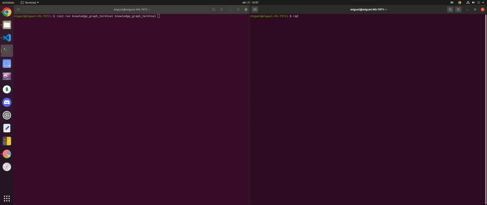
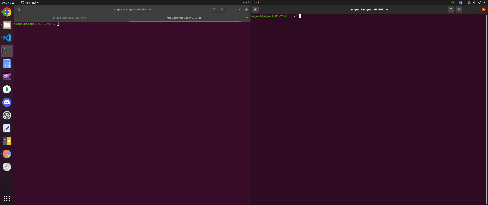

# knowledge_graph

Many times, when you are developing a Software Architecture for robots, you need shared memory where to store information. There are many strategies for this. One of them is a blackboard. Another approach is a graph in which we store elements as graph nodes and relations as graph edges.

ROS 2 knowledge graph provides you a way to share a graph between nodes running in an application. The graph is distributed in all the ROS 2 nodes. Each node contains a replica that is synchronized with all the other replicas, guaranteeing a Strong Eventual Consistency.

<div align="center">

[](https://opensource.org/license/apache-2)
[](https://github.com/mgonzs13/knowledge_graph/releases)
[](https://github.com/mgonzs13/knowledge_graph?branch=master)
[](https://libraries.io/github/mgonzs13/knowledge_graph?branch=master)
[](https://github.com/mgonzs13/knowledge_graph/commits/master)

[](https://github.com/mgonzs13/knowledge_graph/issues)
[](https://github.com/mgonzs13/knowledge_graph/pulls)
[](https://github.com/mgonzs13/knowledge_graph/graphs/contributors)

[](https://github.com/mgonzs13/knowledge_graph/actions/workflows/python-formatter.yml?branch=master)
[](https://github.com/mgonzs13/knowledge_graph/actions/workflows/cpp-formatter.yml?branch=master)

| ROS 2 Distro |                                                                                                               Build and Test                                                                                                               |
| :----------: | :----------------------------------------------------------------------------------------------------------------------------------------------------------------------------------------------------------------------------------------: |
|   **Foxy**   |        [](https://github.com/mgonzs13/knowledge_graph/actions/workflows/foxy-build-test.yml?branch=master)         |
| **Galatic**  |  [](https://github.com/mgonzs13/knowledge_graph/actions/workflows/galactic-build-test.yml?branch=master)   |
|  **Humble**  | [](https://github.com/mgonzs13/knowledge_graph/actions/workflows/humble-build-test.yml?branch=master) |
|   **Iron**   |        [](https://github.com/mgonzs13/knowledge_graph/actions/workflows/iron-build-test.yml?branch=master)         |
|  **Jazzy**   |       [](https://github.com/mgonzs13/knowledge_graph/actions/workflows/jazzy-build-test.yml?branch=master)       |
|  **Kilted**  |     [](https://github.com/mgonzs13/knowledge_graph/actions/workflows/kilted-build-test.yml?branch=master)      |
| **Rolling**  |    [](https://github.com/mgonzs13/knowledge_graph/actions/workflows/rolling-build-test.yml?branch=master)    |

</div>

## Installation

```shell
cd ~/ros2_ws/src
git clone https://github.com/mgonzs13/knowledge_graph.git
cd ~/ros2_ws
rosdep install --from-paths src --ignore-src -r -y
colcon build
```

## Testing

The C++ knowledge graph includes unit tests using GTest. To run the tests:

```shell
cd ~/ros2_ws
colcon test --packages-select knowledge_graph
colcon test-result --verbose
```

## Usage

### C++

```cpp
#include "rclcpp/rclcpp.hpp"
#include "knowledge_graph/knowledge_graph.hpp"

int main(int argc, char ** argv) {
  rclcpp::init(argc, argv);
  auto graph = KnowledgeGraph::get_instance()  rclcpp::spin(node);
  rclcpp::shutdown();
  return 0;
}
```

### Python

```python
import rclpy
from knowledge_graph import KnowledgeGraph


def main():
  rclpy.init()
  graph = KnowledgeGraph.get_instance()
  rclpy.shutdown()


if __name__ == "__master__":
    main()
```

## API

### C++

The complete C++ API of `knowledge_graph::KnowledgeGraph` (extends `knowledge_graph::graph::Graph`) is at [knowledge_graph/include/knowledge_graph/knowledge_graph.hpp](knowledge_graph/include/knowledge_graph/knowledge_graph.hpp). The main API functions are:

#### Node Operations

```cpp
// Create a new node in the graph
Node create_node(const std::string &name, const std::string &type);

// Update a node (adds if not exists)
void update_node(const Node &node);

// Update multiple nodes
void update_nodes(const std::vector<Node> &nodes);

// Remove a node
bool remove_node(const Node &node);

// Remove multiple nodes
const std::vector<graph::Node> remove_nodes(const std::vector<Node> &nodes);

// Check if a node exists
bool has_node(const std::string &name) const;

bool has_node(const Node &node) const;

// Get number of nodes
int get_num_nodes() const;

// Get all nodes
std::vector<Node> get_nodes() const;

// Get a node by name (throws if not found)
Node get_node(const std::string &name) const;
```

#### Edge Operations

```cpp
// Create a new edge
Edge create_edge(const std::string &type, const std::string &source_node, const std::string &target_node);

// Update an edge (adds if not exists)
void update_edge(const Edge &edge);

// Update multiple edges
void update_edges(const std::vector<Edge> &edges);

// Remove an edge
bool remove_edge(const Edge &edge);

// Remove multiple edges
const std::vector<graph::Edge> remove_edges(const std::vector<Edge> &edges);

// Check if an edge exists
bool has_edge(const std::string &type, const std::string &source_node, const std::string &target_node) const;

bool has_edge(const Edge &edge) const;

// Get number of edges
int get_num_edges() const;

// Get all edges
std::vector<Edge> get_edges() const;

// Get edges from a specific source node
std::vector<Edge> get_edges_from_node(const std::string &source_node) const;

// Get edges to a specific target node
std::vector<Edge> get_edges_to_node(const std::string &target_node) const;

// Get edges between specific nodes
std::vector<Edge> get_edges_between_nodes(const std::string &source_node, const std::string &target_node) const;

// Get edges by type
std::vector<Edge> get_edges_by_type(const std::string &type) const;

// Get edges from node by type
std::vector<Edge> get_edges_from_node_by_type(const std::string &type, const std::string &source_node) const;

// Get edges to node by type
std::vector<Edge> get_edges_to_node_by_type(const std::string &type, const std::string &target_node) const;

// Get a specific edge (throws if not found)
Edge get_edge(const std::string &type, const std::string &source_node, const std::string &target_node) const;
```

#### Node/Edge Properties

Nodes and edges inherit from `PropertiesContainer`, providing property management:

```cpp
// Set a property value
template <typename T>
void set_property(const std::string &key, const T &value);

// Get a property value
template <typename T>
T get_property(const std::string &key) const;

// Check if a property exists
bool has_property(const std::string &key) const;
```

Supported property types: `bool`, `int`, `float`, `double`, `std::string`, and vectors of these types.

#### Callbacks

```cpp
// Add a callback to be called when the graph is updated
void add_callback(std::function<void(const std::string &, const std::string &, const std::vector<std::variant<Node, Edge>> &)> callback);

// Clear all registered callbacks
void clear_callbacks();
```

The callback function is called with parameters: operation ('add', 'update', 'remove'), element_type ('node' or 'edge'), and elements (list of Node or Edge objects).

### Python

The complete Python API of `KnowledgeGraph` (extends `Graph`) is at [knowledge_graph/knowledge_graph/knowledge_graph.py](knowledge_graph/knowledge_graph/knowledge_graph.py). The main API functions are:

#### Node Operations

```python
# Create a new node in the graph
def create_node(self, name: str, type_: str) -> Node

# Update a node (adds if not exists)
def update_node(self, node: Node) -> None

# Update multiple nodes
def update_nodes(self, nodes: List[Node]) -> None

# Remove a node
def remove_node(self, node: Node) -> bool

# Remove multiple nodes
def remove_nodes(self, nodes: List[Node]) -> List[Node]

# Check if a node exists
def has_node(self, name: Union[str, Node]) -> bool:

# Get number of nodes
def get_num_nodes(self) -> int

# Get all nodes
def get_nodes(self) -> List[Node]

# Get a node by name (raises RuntimeError if not found)
def get_node(self, name: str) -> Node
```

#### Edge Operations

```python
# Create a new edge
def create_edge(self, type_: str, source_node: str, target_node: str) -> Edge

# Update an edge (adds if not exists)
def update_edge(self, edge: Edge) -> None

# Update multiple edges
def update_edges(self, edges: List[Edge]) -> None

# Remove an edge
def remove_edge(self, edge: Edge) -> bool

# Remove multiple edges
def remove_edges(self, edges: List[Edge]) -> List[Edge]

# Check if an edge exists
def has_edge(self, type_or_edge: Union[str, Edge], source_node: str = None, target_node: str = None) -> bool:

# Get number of edges
def get_num_edges(self) -> int

# Get all edges
def get_edges(self) -> List[Edge]

# Get edges from a specific source node
def get_edges_from_node(self, source_node: str) -> List[Edge]

# Get edges to a specific target node
def get_edges_to_node(self, target_node: str) -> List[Edge]

# Get edges between specific nodes
def get_edges_between_nodes(self, source_node: str, target_node: str) -> List[Edge]

# Get edges by type
def get_edges_by_type(self, type: str) -> List[Edge]

# Get edges from node by type
def get_edges_from_node_by_type(self, type: str, source_node: str) -> List[Edge]

# Get edges to node by type
def get_edges_to_node_by_type(self, type: str, target_node: str) -> List[Edge]

# Get a specific edge (raises RuntimeError if not found)
def get_edge(self, type: str, source_node: str, target_node: str) -> Edge
```

#### Node/Edge Properties

Nodes and edges provide property management:

```python
# Set a property value
def set_property(self, key: str, value: Any) -> None

# Get a property value
def get_property(self, key: str) -> Any

# Check if a property exists
def has_property(self, key: str) -> bool
```

Supported property types: `bool`, `int`, `float`, `str`, and lists of these types.

#### Callbacks

```python
# Add a callback to be called when the graph is updated
def add_callback(self, callback: Callable[[str, str, List[Union[Node, Edge]]], None]) -> None

# Clear all registered callbacks
def clear_callbacks(self) -> None
```

The callback function is called with parameters: operation ('add', 'update', 'remove'), element_type ('node' or 'edge'), and elements (list of Node or Edge objects).

## Demos

- Termial & Viewer

```shell
ros2 run knowledge_graph_terminal knowledge_graph_terminal
```

```shell
ros2 run knowledge_graph_viewer rqt_knowledge_graph
```



- SQLite

```shell
ros2 run knowledge_graph_db knowledge_graph_db_node --ros-args -p db_file:=my_knowledge_graph.db
```


